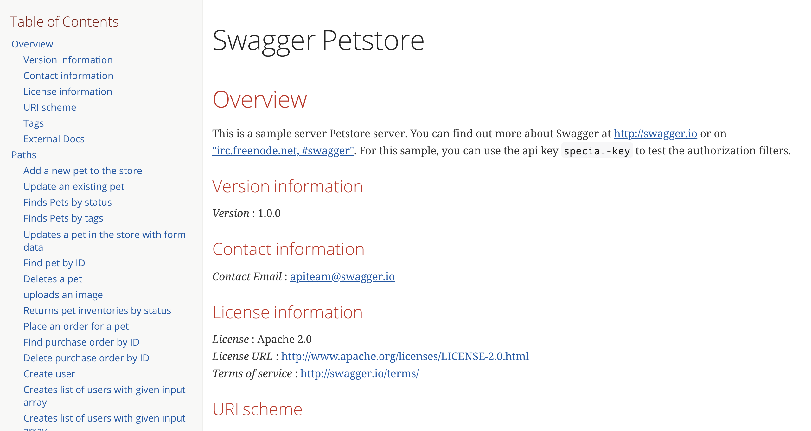

# Swagger API HTML Generator
Generate API document from swagger file.



⚠Does not support OpenAPI 3.0 format⚠

This tool is based on [this article](http://iktakahiro.hatenablog.com/entry/2016/11/23/100000)

## Usage
```console
$ docker run \
  -v {SWAGGER_FILE_DIRECTRY}:{MOUNT_PATH} \
  ryutah/swagger-document {SWAGGER_FILE_PATH} {OUTPUT_FILE_PATH}
```

### example
Generate document named `sample.html` in current directory from swagger definition file named `swagger.yaml` in same directory.

```
$ docker run \
  -v $(pwd):/work \
  ryutah/swagger-document /work/sample.yaml /work/sample.html
```

## Example
https://ryutah.github.io/docker-swagger-document/
